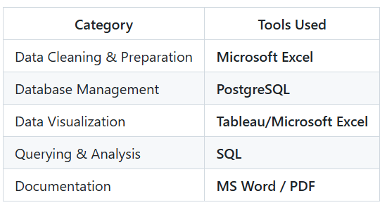

# 🧠 Customer and Advertising Analytics

## 📋 Overview
This project was completed as part of the **Data Analytics Career Accelerator** from **The London School of Economics and Political Science (LSE)** in collaboration with FourthRev.

**Objective:**  
To help the marketing team at **2Market** design a data-driven marketing campaign by understanding their customers, products, and advertising channels.

---

## 🎯 Business Problem
> “2Market needs to create a marketing campaign, and for that, it must understand its customers, products, and advertising channels.”

This analysis sought to uncover:
- Who are the key customer segments (age, income, marital status, country)?
- Which product categories generate the most sales overall and by customer group?
- Which advertising channels are most effective for different demographics?

---

## 🧰 Tools & Technologies

---

## 🔍 Data Preparation
The raw dataset contained customer, product, and marketing information.  
Key cleaning steps in **Excel**:

- Used the `TRIM()` function to remove blank spaces in headers.  
- Renamed unclear columns based on metadata.  
- Standardized country abbreviations (`SP` → `ESP`, `SA` → `RSA`).  
- Converted income and date columns from text to numeric/date types.  
- Removed three invalid records (ages beyond the oldest known human).  
- Calculated customer ages using **2024** as the base year.  
- Imported the final cleaned dataset (**2,213 records**) into **PostgreSQL** for further analysis.

---

## 📊 Dashboard Design

### 1. Customer Demographics & Sales Dashboard
**Goal:** Visualize customer composition and product sales by demographic group.  
**Features:**
- Bar charts and a map showing country distribution.  
- Interactive filters for age, income, marital status, and country.  
- Accessible color palette and readable fonts.

### 2. Advertising Channel Effectiveness Dashboard
**Goal:** Measure performance of each advertising channel by customer group.  
**Features:**
- Bar charts comparing channel effectiveness by age, country, and marital status.  
- Interactive filters for exploring specific customer segments.

---

## 📈 Key Insights

### 🧍 Customer Demography
- **Average customer age:** 54 years  
- **Average income:** \$52,237  
- Majority of customers are **married** and live in **Spain (49%)**

### 🛒 Product Sales
- **Top-selling product:** Alcoholic Beverages  
- **Highest spending age group:** 50–59 years  
- Sales rise with income up to \$79k, then gradually decline.  
- Meat products sells most among customers earning **> \$100k**.

### 📣 Advertising Effectiveness
- **Most effective channel:** Twitter  
- **Least effective channel:** Brochure  
- Channel performance varies slightly by country and customer demographics.

---

## 💡 Recommendations
- Prioritize **Twitter** for advertising campaigns as it is the most effective channel overall.  
- Target **50–59-year-old** customers, especially in **Spain**.  
- Promote alcoholic beverages and meat products to high-income customers.
- Product Bundling offers could be made with alcohol + meat products as customers who purchased alcohol also purchased meat products.
- Further analyze **in-store vs online sales**.

---

## 🧩 Skills Demonstrated
- Data cleaning & transformation in Excel  
- SQL querying & data import in PostgreSQL  
- Dashboard design in Tableau
- Exploratory data analysis
- Business storytelling

---

## 📄 Project Documentation & Technical Report

👉 [Open and Read the Full Technical Report (PDF)](https://github.com/DKL59/DKL59/blob/main/report1.pdf)

---

## 🎥 Project Presentation Video
<video src="https://github.com/user-attachments/assets/f8a76b7c-b399-49f5-87a5-397e0ebc87e1" controls width="100%">
  Your browser does not support the video tag.
</video>

---

## 👤 Author
**Dipendra Limbu**  
📍 Nepal  💼 Data Analyst | Business Intelligence Analyst 
<a href="https://www.linkedin.com/in/dipendra-limbu-4234901a9/" target="_blank" rel="noopener noreferrer">LinkedIn</a>
 | [GitHub](#)

---

## 🏁 Summary
This project demonstrates a complete analytics workflow — from data cleaning, insight generation to visualization and — translating data into actionable marketing recommendations for strategic decision-making.
