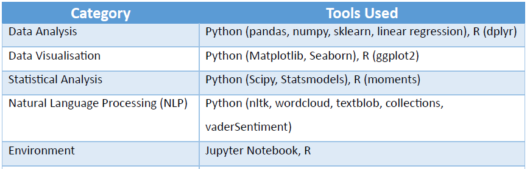
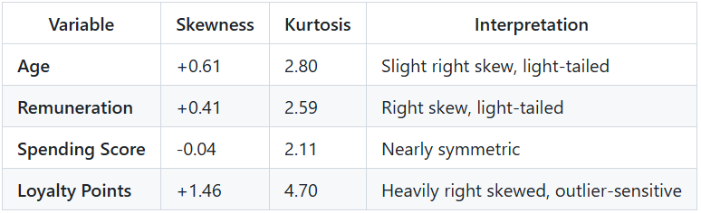
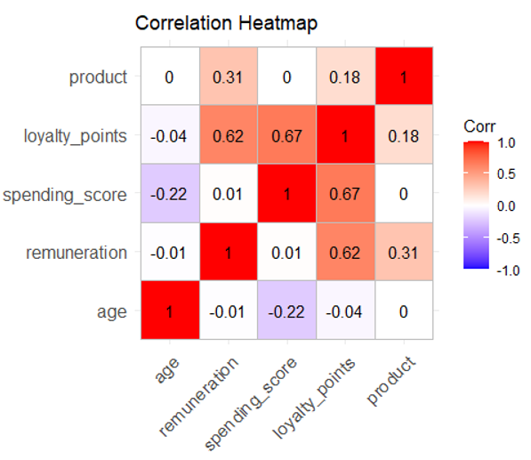
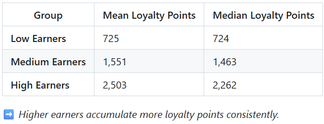
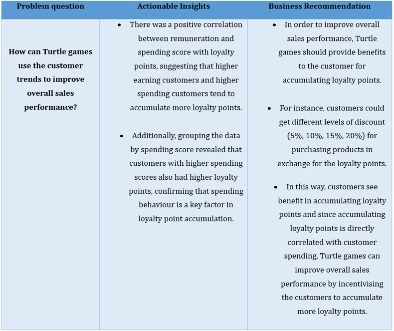

# 🎮 Turtle Games Customer Trends Analysis

---

## 💻 Complete Python Code & Data Visualizations

👉 [Open the Jupyter Notebook (.ipynb)(LSE_DA301_FINAL_Assignment_Python_Limbu_Dipendra_Turtle_games.ipynb)](https://nbviewer.org/github/DKL59/DKL59/blob/main/LSE_DA301_FINAL_Assignment_Python_Limbu_Dipendra_Turtle_games.ipynb)

## 📈 R Script 

👉 [Open the R Script (marketing_analysis.R)](LSE_DA301_Assignment_R_Limbu_Dipendra.R)

## 📄 Technical Report

👉 [Open and Read the Full Technical Report (PDF)]([https://github.com](https://github.com/DKL59/DKL59/blob/main/report2.pdf)

---

## 📋 Overview
This project was completed as part of the **Data Analytics Career Accelerator** from **The London School of Economics and Political Science (LSE)** in collaboration with FourthRev.

**Objective:**  
To identify customer trends that can help **Turtle Games** improve its overall sales performance through data-driven insights and customer segmentation.

---

## 🎯 Business Problem
> “How can Turtle Games use customer trends to improve overall sales performance?”

The analysis focused on:
- Understanding the relationship between **customer demographics** (age, remuneration, spending score) and **loyalty points**.  
- Exploring **customer sentiment** from reviews and summaries to gauge perception.  
- Segmenting customers based on **income and spending patterns** to tailor marketing strategies.

---

## 🧰 Tools & Technologies

---

## 🔍 Analytical Approach

1. **Exploratory Data Analysis (EDA)**  
   - Assessed age, remuneration, spending score, and loyalty points distributions.  
   - Calculated skewness and kurtosis for each variable to understand data symmetry and tail behaviour.

2. **Correlation Analysis**  
   - Generated a **correlation heatmap** to identify relationships between key variables.  
   - Found strong positive correlations between **spending score**, **remuneration**, and **loyalty points**.

3. **Customer Segmentation**  
   - Segmented customers into income and spending categories: *Low*, *Medium*, and *High*.  
   - Analyzed loyalty point accumulation within each group.

4. **Sentiment Analysis**  
   - Used **nltk**, **textblob**, **vaderSentiment**  to calculate sentiment polarity of customer **summaries** and **reviews**.  
   - Analyzed most frequent words and their sentiment polarity using **wordcloud** to determine overall tone.

---

## 📊 Key Insights

### 🧍 Demographic Overview
- **Average customer age:** 39 years (range: 17–72).  
- **Average annual remuneration:** £48,080 (range: £12,300–£112,340).  
- **Average spending score:** 50 (range: 1–99).  
- **Average loyalty points:** 1,578 (range: 25–6,847).
   
---

### 📈 Distribution Analysis

---

## 💳 Correlation Findings

- **Remuneration ↔ Loyalty Points:** Moderate positive correlation (**r = 0.62**)  
- **Spending Score ↔ Loyalty Points:** Stronger positive correlation (**r = 0.67**)  
- Indicates that higher spenders and earners accumulate more loyalty points.

---

## 👥 Customer Segmentation Insights

### Loyalty Points by Remuneration Group

### Loyalty Points by Spending Group
- **High Spending** customers accumulate the **most loyalty points**.  
- **Medium-High** group shows balanced and consistent loyalty accumulation.  
- **Low Spending** group occasionally contains outliers with very high loyalty points.  

### Customer Clustering
- Identified **five customer clusters** based on **spending and remuneration patterns**.  
- These clusters provide opportunities for **targeted promotions** and **personalized campaigns**.

---

## 💬 Sentiment Analysis Results

### Summary Sentiment
- **Mean polarity:** +0.22 → *Generally positive tone*  
- Common positive words: *“great”, “good”, “love”, “cute”*  
- Occasional neutral/negative mentions: *“game”* (some critiques)

### Review Sentiment
- **Mean polarity:** +0.217 → *Slightly positive overall sentiment*  
- Frequent words: *“great”, “fun”, “love”, “good”*  
- Suggests overall positive customer experience with some minor product feedback.

---

## 💡 Recommendation

---

## 🧩 Skills Demonstrated
- Data wrangling and descriptive statistics  
- Correlation and clustering analysis  
- Sentiment analysis using NLP (TextBlob)  
- Data visualization and business interpretation  
- Communicating insights through structured reporting  

---

## 👤 Author
**Dipendra Limbu** |📍 Nepal | 💼 Data Analyst | Business Intelligence | 📧 dklimbuz@hotmail.com

---

### 🌐 Connect With Me
<a href="https://www.linkedin.com/in/dipendra-limbu-4234901a9/" target="_blank" rel="noopener noreferrer">LinkedIn</a>
 | <a href="https://github.com/DKL59/Dipendra-Limbu" target="_blank" rel="noopener noreferrer">GitHub</a>

---

## 🏁 Summary
This project demonstrates how data analytics can uncover key customer trends that drive actionable sales strategies.  
Through correlation, segmentation, and sentiment analysis, the study provides **evidence-based recommendations** for improving Turtle Games’ sales and loyalty performance.
