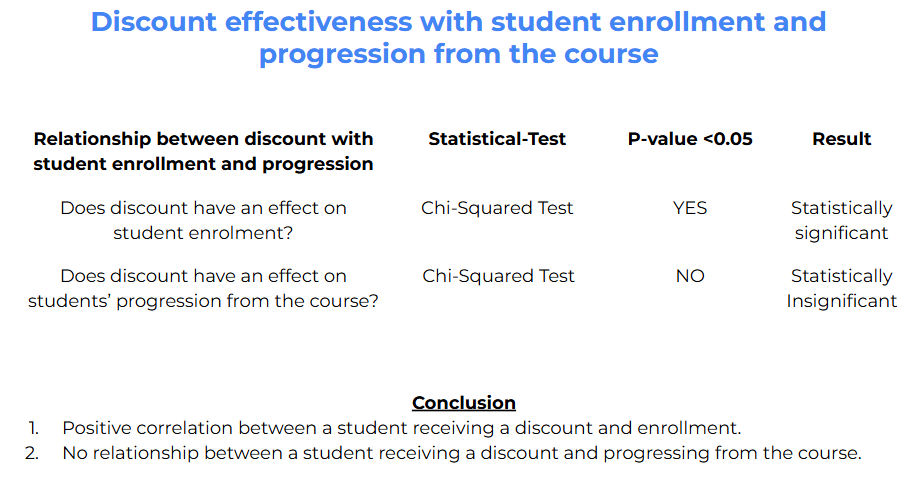
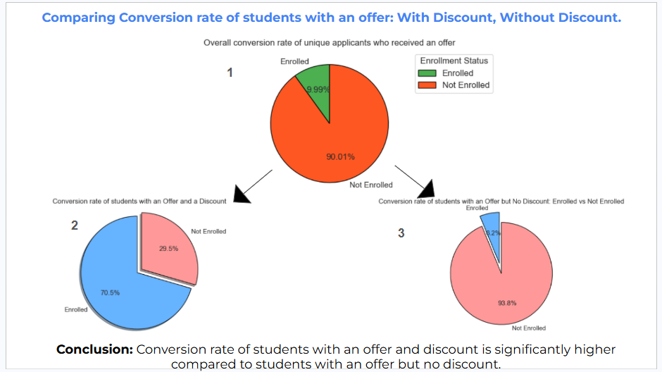
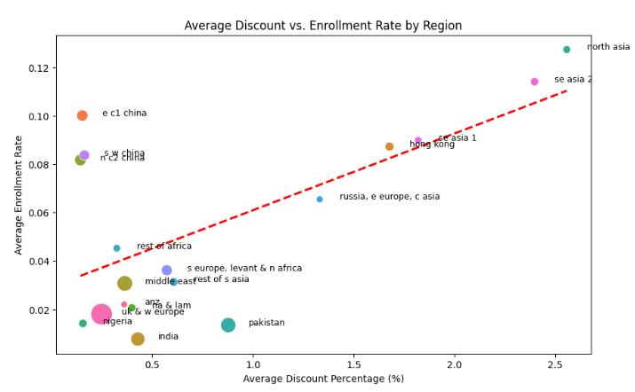
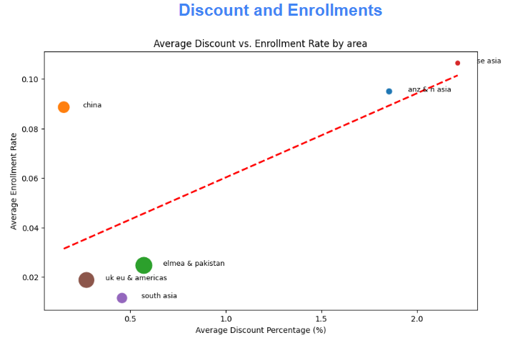

# 🎓 StudyGroup 

## 💻 Complete Python Code & Data Visualizations

👉 [Open the Jupyter Notebook](https://github.com/DKL59/DKL59/blob/main/EDASTUDYGROUP.ipynb)

---

### 🔍 Evaluating the Impact of Scholarship Discounts on Student Enrolment

*A data analytics case study evaluating the effectiveness of scholarship discounts on student enrolment through exploratory data analysis, statistical hypothesis testing, regression analysis, and data visualisation.*

---

# 📖 Executive Summary

Scholarship programmes represent a significant financial investment for educational institutions, yet their effectiveness is rarely evaluated using data.

This project analyses historical student application data from **StudyGroup** to determine whether scholarship discounts influence student enrolment and academic progression.

Using **Python** and **statistical hypothesis testing**, the analysis identifies the true impact of scholarship incentives and provides evidence-based recommendations for optimising future scholarship allocation.

---

# 🎯 Business Objectives

✔ Evaluate the impact of scholarship discounts on student enrolment.

✔ Determine whether discounts influence student progression.

✔ Analyse scholarship allocation across regions.

✔ Identify opportunities to improve scholarship investment.

---

# 🛠 Technology Stack

| Category | Tools |
|----------|-------|
| **Programming** | Python|
| **Libraries** | pandas, numpy, matplotlib, seaborn, scipy, statsmodels  |
| **Visualisation** | matplotlib, seaborn |
| **Data cleaning** | Excel |
| **Environment** | Jupyter Notebook |

---

# 🚀 Project Workflow

| 📥 Collect | 🧹 Clean | 🔍 Analyse | 📊 Visualise | 📈 Validate | 💡 Recommend |
|:----------:|:--------:|:----------:|:------------:|:-----------:|:------------:|
| Raw Dataset | Data Wrangling | Exploratory Data Analysis | Charts & Dashboards | Chi-Square Test | Business Recommendations |

---

# 📊 Statistical Validation

Rather than relying solely on descriptive analytics, this project applies a **Chi-Square Test of Independence** to determine whether scholarship discounts have a statistically significant relationship with student enrolment and progression.

### Results

| Hypothesis | Outcome |
|------------|---------|
| Scholarship discounts increase student enrolment | ✅ **Supported** |
| Scholarship discounts improve academic progression | ❌ **Not Supported** |

> **Key Finding**
>
> Scholarship discounts significantly influence **student enrolment**, but they do **not** have a statistically significant effect on student progression.

---

# 📊 Results & Insights

## 1️⃣ Scholarships Increase Student Enrolment

    | Metric | Result |
    |:-------|-------:|
    | Offer → Enrolment Conversion | **9.99%** |
    | Conversion with Discount | **70.5%** |
    | Conversion without Discount | **6.2%** |

### Business Insight

Applicants receiving a scholarship discount were **more than 11 times more likely to enrol** than applicants receiving an offer without financial support.
This demonstrates that scholarship incentives are one of the strongest drivers of enrolment conversion.

---

## 2️⃣ Regional Analysis

### Key Insights

- North Asia achieved the strongest enrolment performance.
- South East Asia also demonstrated consistently high conversion.
- Pakistan, India and Nigeria showed comparatively low enrolment despite scholarship investment.
- Scholarship effectiveness varies considerably between regions.

**Recommendation**

Adopt region-specific scholarship strategies rather than a uniform global allocation model.

---

## 3️⃣ Area-Level Analysis

### Key Insights

- China achieved strong enrolment despite relatively low discounts.
- ANZ & East Asia combined high discounts with strong enrolment outcomes.
- UK & Americas and South Asia underperformed relative to scholarship investment.

These findings suggest that scholarship allocation should be informed by historical conversion performance rather than average discount percentages alone.

---

# 💼 Business Recommendations

- Optimise scholarship allocation using regional conversion performance.
- Continue investment in consistently high-converting markets.
- Reassess scholarship spending in low-performing regions.
- Incorporate additional enrolment drivers beyond financial incentives.

---

# 🧠 Competencies Demonstrated

- 🧹 Data Cleaning & Preparation
- 📊 Exploratory Data Analysis (EDA)
- 📈 Data Visualisation
- 🧪 Chi-Square Hypothesis Testing
- 📉 OLS Regression Analysis
- 💡 Data-Driven Decision Making
- 📝 Technical Reporting

---

# 📈 Project Impact

This analysis provides StudyGroup with a data-driven framework for evaluating scholarship effectiveness.

The findings demonstrate that scholarships are highly effective at improving **student enrolment**, while offering little measurable benefit to **academic progression**. These insights enable more strategic allocation of scholarship funding and support evidence-based decision-making.

---

### ⭐ If you enjoyed this project, consider giving it a star!

